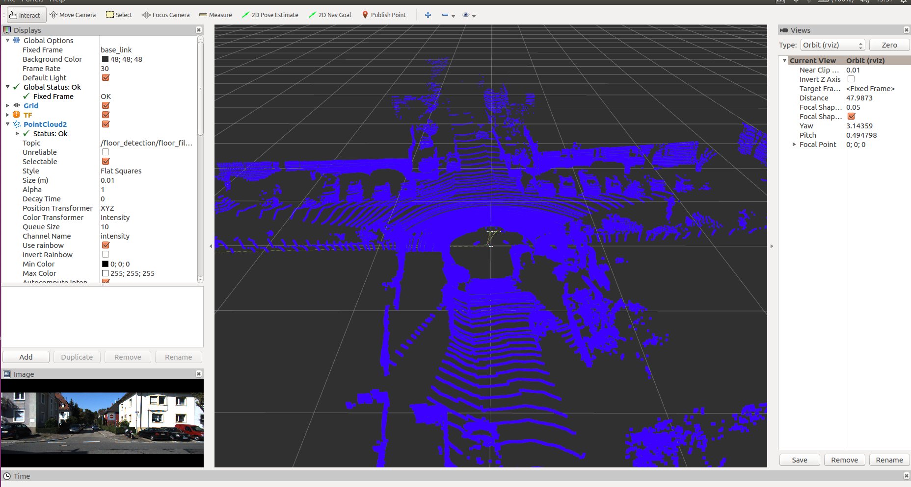

#前言
该项目是基于KITTI自动驾驶测试集，测试比较Lego-loam和hdl_graph_slam建图效果。

# 1.这些代码怎么用
每个代码都有对应的readme.md，需要安装的依赖等参考具体的readme.md文件

# 2.测试数据
开源程序最好使用开放数据集，所以我们选择了KITTI，并且把RawData里的"2011_10_03_drive_0027_sync"做成了bag文件，后面所有程序的测试都是在这个bag基础上做的。
数据文件我放在了百度网盘里
地址：https://pan.baidu.com/s/1TyXbifoTHubu3zt4jZ90Wg
提取码: n9ys

# 3.建图的效果
Lego-loam

    

hdl_graph_slam

    

